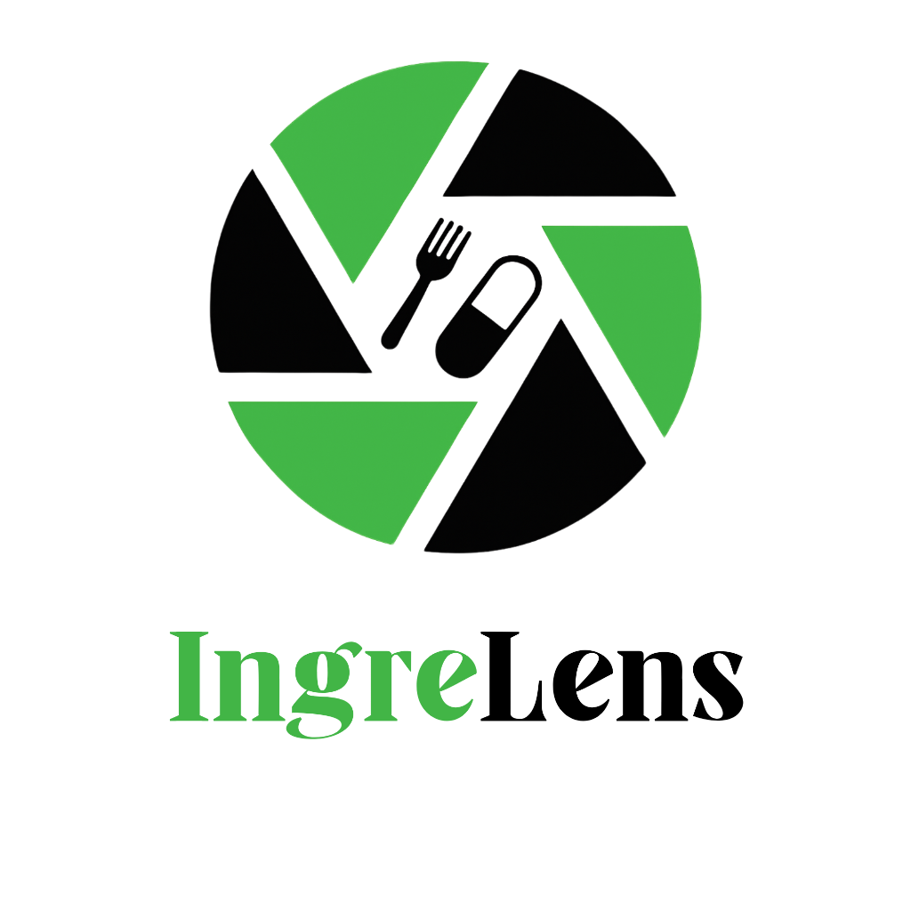

<p align="center">
  
</p>

<h1 align="center">IngreLens</h1>

<p align="center">
  <strong>Your personal AI health shield for food & medicine labels.</strong><br/>
  Scan a label, get an instant personalised safety report — powered by Gemini AI.
</p>

<p align="center">
  
  
  
  
  
</p>

---

## ✨ Features

| Feature | Description |
|---------|-------------|
| 📸 **Label Photo Scan** | Capture or upload a label photo — OCR extracts the text automatically via Tesseract.js |
| 🔍 **Barcode Scan** | Scan any food or medicine barcode to instantly pull product info from open catalogs |
| ✍️ **Manual Text Entry** | Paste or type label text directly for analysis |
| 🤖 **AI Analysis** | Gemini AI reads every ingredient and rates it Safe / Caution / Hazardous for *you* |
| 🛡️ **Personalised Safety Score** | 0–10 score based on your allergies, conditions, medications, and health goals |
| 💊 **Food & Medicine Modes** | Separate analysis modes with medicine-specific interaction warnings |
| 👤 **Health Profile** | Save your allergies, conditions, medicines, and goals for tailored results every time |
| 📋 **Scan History** | All your past scans stored and browsable — revisit any result anytime |
| 📰 **Health News Feed** | Curated health articles on the home screen |

---

## 🖥️ Tech Stack

### Frontend
- **React 18** + **Vite** — fast, modern UI
- **Tesseract.js** — in-browser OCR for label photo reading
- **ZXing** — barcode scanning via device camera
- **Tailwind CSS** — utility-first styling
- **Lucide React** — icons

### Backend
- **FastAPI** (Python) — REST API
- **Motor** — async MongoDB driver
- **bcrypt** — secure password hashing
- **HMAC tokens** — lightweight stateless auth (no JWT dependency)

### Infrastructure
- **MongoDB Atlas** — cloud database
- **Gemini AI** (`gemini-3.6-flash`) — ingredient analysis
- **Vercel** — frontend + serverless Python API deployment

---

## 🚀 Getting Started

### Prerequisites
- Node.js 18+ & Yarn
- Python 3.11+
- MongoDB Atlas account (free tier works)
- Google AI Studio API key ([get one free](https://aistudio.google.com/apikey))

### 1. Clone the repo
```bash
git clone https://github.com/anushamuhuri7/IngreLens--repo.git
cd IngreLens--repo
```

### 2. Set up the backend
```bash
pip install -r requirements.txt
```

Create `backend/.env`:
```env
MONGO_URL=mongodb+srv://<user>:<password>@cluster0.xxxxx.mongodb.net/?appName=Cluster0
DB_NAME=ingrelens
SECRET_KEY=your-long-random-secret
GEMINI_API_KEY=your-google-ai-studio-key
GEMINI_MODEL=gemini-3.6-flash
```

### 3. Set up the frontend
```bash
yarn install
```

### 4. Run locally
```bash
# Terminal 1 — Backend
python -m uvicorn app.main:app --host 0.0.0.0 --port 8001

# Terminal 2 — Frontend
yarn dev
```

Open **http://localhost:3000**

---

## ☁️ Deploying to Vercel

1. Push your code to GitHub
2. Import the repo in [Vercel](https://vercel.com)
3. Add these **Environment Variables** in Vercel dashboard:

| Variable | Value |
|----------|-------|
| `MONGO_URL` | Your MongoDB Atlas connection string |
| `DB_NAME` | `ingrelens` |
| `SECRET_KEY` | A long random secret string |
| `GEMINI_API_KEY` | Your Google AI Studio key |
| `GEMINI_MODEL` | `gemini-3.6-flash` |

4. Deploy! Vercel handles both the React frontend and FastAPI backend via `api/index.py`.

> ⚠️ **Never commit `backend/.env` to git.** It is gitignored for your safety.

---

## 📁 Project Structure

```
IngreLens/
├── app/                    # FastAPI backend
│   ├── main.py             # API routes (auth, scan, profile, history)
│   ├── ai_analyzer.py      # Gemini AI label analysis
│   ├── barcode_service.py  # Barcode lookup service
│   └── ocr_engine.py       # Server-side OCR engine
├── api/
│   └── index.py            # Vercel serverless entrypoint
├── src/                    # React frontend
│   ├── App.jsx             # Main app (all pages & components)
│   ├── components/
│   │   └── BarcodeScanner.jsx
│   └── lib/
│       ├── api.js          # API client with auth headers
│       └── ocr.js          # Tesseract.js OCR wrapper
├── assets/                 # Logo and images
├── backend/.env            # 🔒 Local secrets (gitignored)
├── frontend/.env           # Frontend config
├── vercel.json             # Vercel deployment config
└── vite.config.js          # Vite + dev proxy config
```

---

## 🔒 Security Notes

- Passwords are hashed with **bcrypt**
- Auth tokens use **HMAC-SHA256** signing
- Login is **rate-limited** (5 attempts → 15-minute lockout)
- All secrets are stored in **environment variables**, never in code
- `backend/.env` is **gitignored** — add secrets via your hosting dashboard

---

## 📄 License

MIT © [Anusha Muhuri](https://github.com/anushamuhuri7)
